# Project 6 - WordPress Web Solution Deployment

**Step 1 - Set Up The Web Server**
---

- Created a Redhat EC2 instance named "Web Server". Created and attached 3 10GB EBS volumes to the web server.

- SSHd into the server and ran the `lsblk` command to check what storage blocks were attached to the server. Screenshot below shows that the 3 created storage blocks were successfully assigned.
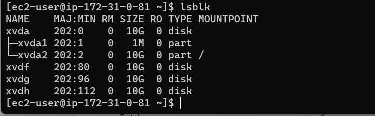
*The three disks are identified as `xvdf`, `xvdg` & `xvdh`.*

- Ran `df -h` to see all mounts and free space on the server.
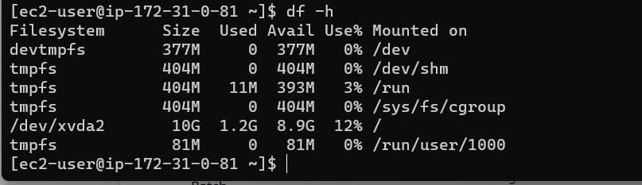

- Here, the `gdisk` utility would be used to create a partition on all the disks as they currently do not have any partition.

    - Ran `sudo gdisk /dev/xvdf` to create a partition on the `xvdf` block. Use screenshot as guide.
    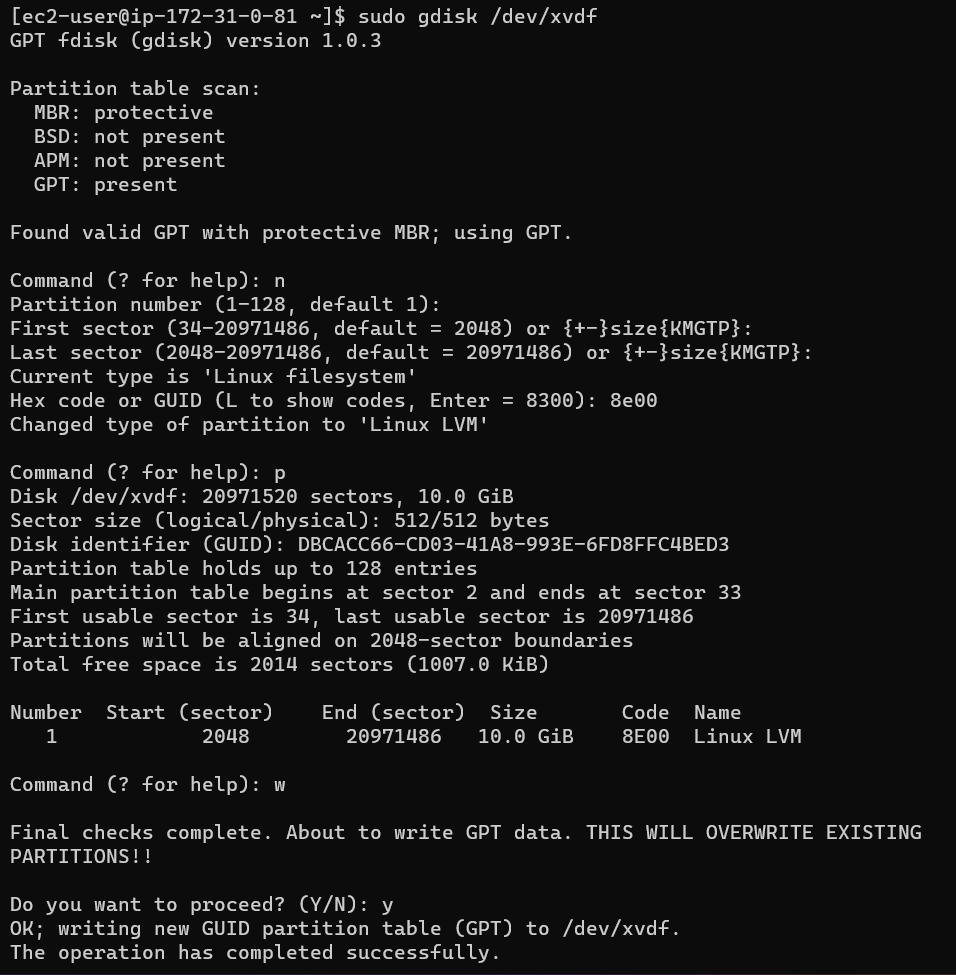
    *When creating a new partition, use 8e00 to select LVM*

    - Repeated the above command for the `xvdg` & `xvdh` blocks.

    - After running the `gdisk` utility on all the blocks, run `lsblk` to see the updated list.
    

- Install `lvm2` which will be used to chek for available partitions. Use `sudo yum install`. After installation, run `sudo lvmdiskscan` to check partition.
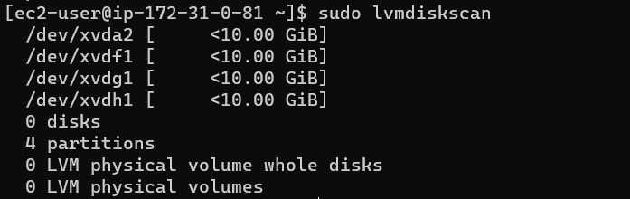

- Next, the `pvcreate` utility is used to mark each of the 3 disks as physical volumes to be used by LVM.
```
sudo pvcreate /dev/xvdf1
sudo pvcreate /dev/xvdg1
sudo pvcreate /dev/xvdh1
```
After running the above commands, run `sudo pvs` to verify if the physical volume was successfully created.
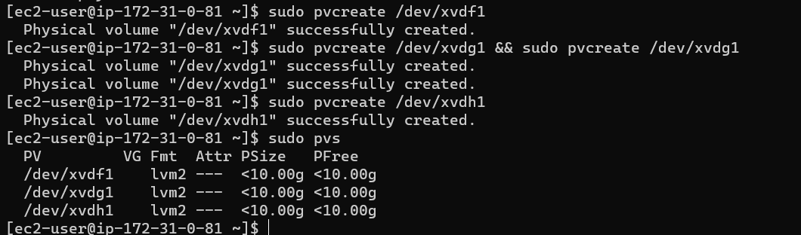

- Next, use `vgcreate` utility to add all the created  physical volumes into a volume group. Used `sudo vgcreate webdata-vg /dev/xvdh1 /dev/xvdg1 /dev/xvdf1` for all PVs. After running, use `sudo vgs` to verify.
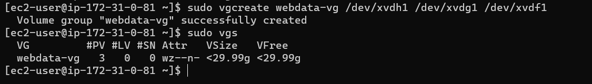

- Used the `lvcreate` utility to create 2 logical volumes. One called `apps-lv` and the other called `logs-lv`. Ran the code below to achieve that
```
sudo lvcreate -n apps-lv -L 14G webdata-vg
sudo lvcreate -n logs-lv -L 14G webdata-vg
```
Verified the logical volume using `sudo lvs`.
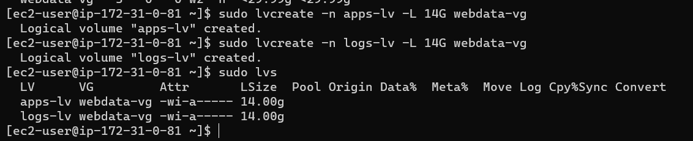

- Verified the entire setup by running `sudo lsblk`


- Next step would be to format the logical volumes with the ext4 filesystem. Use the command below.
```
sudo mkfs -t ext4 /dev/webdata-vg/apps-lv
sudo mkfs -t ext4 /dev/webdata-vg/logs-lv
```
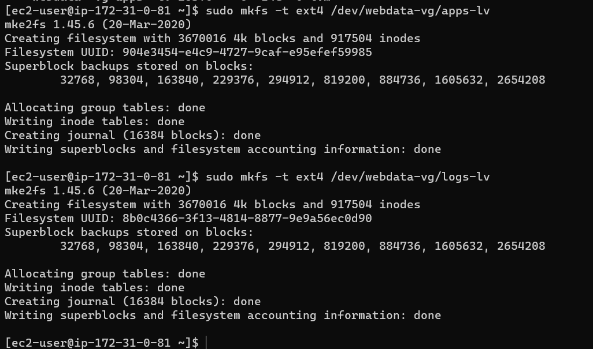
*`sudo mkfs.ext4` can be used instead of `sudo mkfs -t ext4`.*

- Created 2 directories to store website files and log data. `/var/www/html` for website files and `/home/recovery/logs` for log data.

- Mounted the `/var/www/html` directory on the `apps-lv` logical volume using `sudo mount /dev/webdata-vg/apps-lv /var/www/html/`.

- Here, the `rsync` utility will be used to backup all the files from `/var/log` into `/home/recovery/logs`. This is done by running `sudo rsync -av /var/log/. /home/recovery/logs/`.

- After the above step is done, mount `/var/log` on `logs-lv` using `sudo mount /dev/webdata-vg/logs-lv /var/log`.

- After mounting `/var/log` on `logs-lv`, run `sudo rsync -av /home/recovery/logs/. /var/log` to restore log files back into the `/var/log` directory.

**Step 1.1 - Update FSTAB File**
---

- Ran `sudo blkid` to get the UUID of the device that would be used to update the `fstab` file.
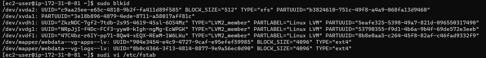

- After running the code above, the UUID will be displayed. Copy it from there and use it to update the `/etc/fstab` file in the format as seen below.
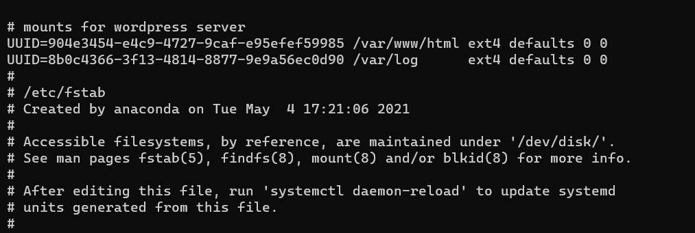

Run the command below to test the configuration and reload the daemon.
```
sudo mount -a
sudo systemctl daemon-reload
```

- Verify setup by running `df -h`.

**Step 2 - Preparing the Database Server**
---

- Launched another Redhat EC2 instance that would serve as the database server.
Repeated the same config steps from step 1 for the DB server.
**Note** - *Instead of creating `apps-lv` like in the web server, create `db-lv` instead and mount it to `/db` directory instead of the `/var/www/html` of the web server.

**Step 3 - Install WordPress On The Web Server**
---

- Ran `sudo yum update -y` to update the repository.

- Ran `sudo yum -y install wget httpd php php-mysqlnd php-fpm php-json` to install Apache and it's dependencies.

    - Started Apache by running the command below.
```
sudo systemctl enable httpd
sudo systemctl start httpd
```

- Ran the command below to install PHP and it's dependencies.
```
sudo yum install https://dl.fedoraproject.org/pub/epel/epel-release-latest-8.noarch.rpm
sudo yum install yum-utils http://rpms.remirepo.net/enterprise/remi-release-8.rpm
sudo yum module list php
sudo yum module reset php
sudo yum module enable php:remi-7.4
sudo yum install php php-opcache php-gd php-curl php-mysqlnd
sudo systemctl start php-fpm
sudo systemctl enable php-fpm
setsebool -P httpd_execmem 1
```

- After installing PHP, restart Apache by running `sudo systemctl restart httpd`

- Next step is to download Wordpress and copy it to the `/var/www/html` directory. This was done using the commands below.
```
mkdir wordpress
cd   wordpress
sudo wget http://wordpress.org/latest.tar.gz
sudo tar xzvf latest.tar.gz
sudo rm -rf latest.tar.gz
cp wordpress/wp-config-sample.php wordpress/wp-config.php
cp -R wordpress /var/www/html/
```

- Next, the SELinux policies needed to be configured and that was done using the commands below.
```
sudo chown -R apache:apache /var/www/html/wordpress
sudo chcon -t httpd_sys_rw_content_t /var/www/html/wordpress -R
sudo setsebool -P httpd_can_network_connect=1
```

**Step 4 - Install MySQL On Your DB Server EC2**
---

- Ran `sudo yum update` & `sudo yum install mysql-server` to update the repo and install MySQL on the DB server.

- Ran the commands below to check the status of, restart and enable MySQL server on the DB machine.
```
sudo systemctl status mysqld
sudo systemctl restart mysqld
sudo systemctl enable mysqld
```

**Step 5 - Configure DB To Work With WordPress**
---

- After MySQL has been installed on the DB, run the below commands to create a database, create a user, grant the user permissions on the database and then flush/save changes.
```
sudo mysql
CREATE DATABASE wordpress;
CREATE USER `myuser`@`<Web-Server-Private-IP-Address>` IDENTIFIED BY 'mypass';
GRANT ALL ON wordpress.* TO 'myuser'@'<Web-Server-Private-IP-Address>';
FLUSH PRIVILEGES;
SHOW DATABASES;
exit
```
*The `<Web-Server-Private-IP-Address>` is strongly recommended to prevent connection from any IP address. It also bolsters security in the DB*

- For added security, we need to bind the address of incoming connections on the DB server. Leaving this open ended will allow connections from anywhere (which is something we wouldn't want).
Run the `sudo /etc/my.cnf` command to edit the config file on the DB server and then add the `bind-address` line with the private IP of the web server to the config file. See example screenshot below:
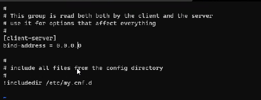

**Step 6 - Configure WordPress To Connect To Remote Database**
---

- Open up MySQL port 3306 on the DB Server to allow the web server reach the DB. **However,** only enable access from the web server's local/private IP address. This is strongly recommended for added security. See below:
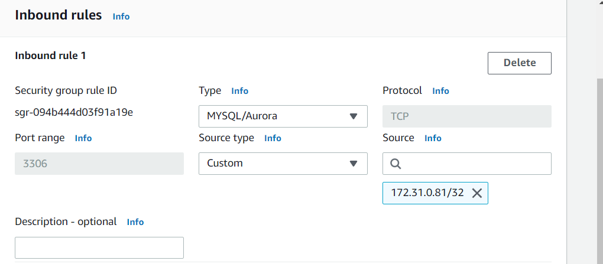

- Install MySQL client on the web server to be able to connect to the DB server remotely. THis was achieved by `sudo yum install mysql`.

- Run the command `sudo mysql -u admin -p -h <DB-Server-Private-IP-address>` to confirm if the created user can connect remotely from the web server to the database server.
1[dbadmin](dbadmin.png)

- After the connection is successful, run `show databases;` to see if the created user has access to the database that was created on the DB server in step 5. In this case, the DB name is `wordpress`.
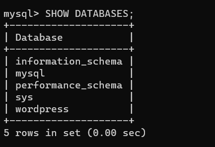

- Next, enable TCP port 80 in the NSG for the web server to allow you access WordPress on the browser.

**Step 6.1 - Modify WordPress Config File to "See" Remote Database**
---

- Here, we need to modify the `wp-config.php` file on the web server to enable WordPress communicate with the DB server. If this is not done, there will be an error while trying to access WordPress on the browser (it is actually very easy to forget to do this and can cause a LOT of headaches seeing an error on your screen and not knowing why it's happening)
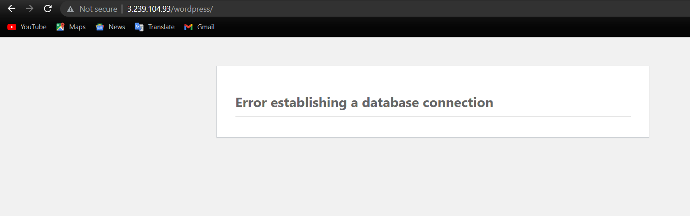

    - Run `cd wordpress` on the WS and locate the `wp-config.php` file. After this file has been found, insert the correct database name, username, password and host IP and then save. This will allow WordPress to communicate with the DB server.
    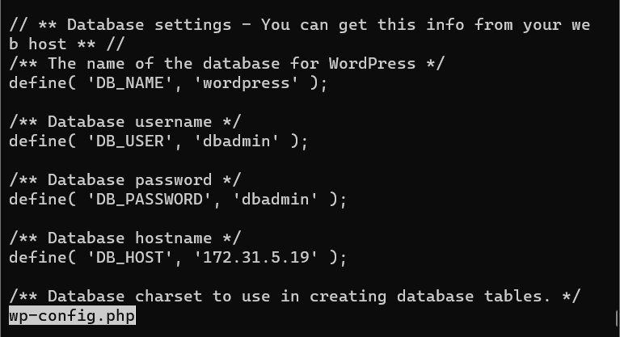

- Try accessing WordPress from the browser by using this format `http://<Web-Server-Public-IP-Address>/wordpress/`. See result below:
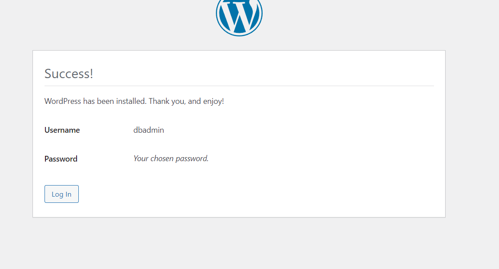

- Fill out the credentials to successfully create an account. After that, login with the credentials to be taken to the homepage.
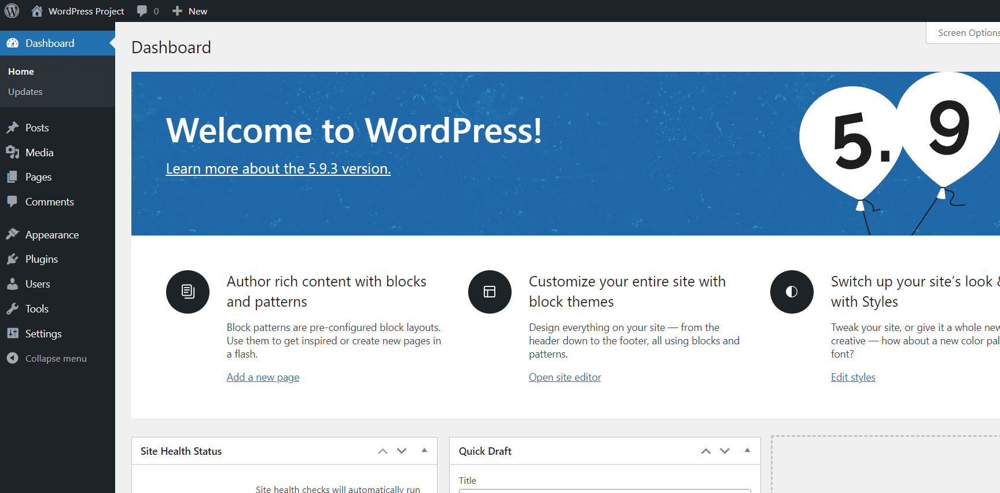

**WordPress Solution Deployed Successfully!**